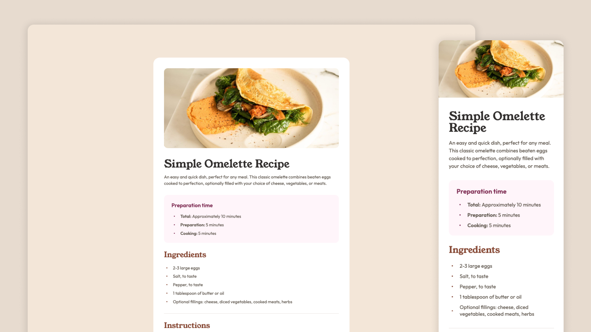

# Frontend Mentor - Recipe page solution

This is a solution to the [Recipe page challenge on Frontend Mentor](https://www.frontendmentor.io/challenges/recipe-page-KiTsR8QQKm). Frontend Mentor challenges help you improve your coding skills by building realistic projects. 

It was a fun and simple project to do, I'm trying to use Tailwind more often to fix its classes. I used Figma to help me with the sizes and distances and applied everything with Tailwind, trying to use the most semantic tags in HTML.

## Overview

### Screenshot

### Links

- Solution URL: [Solution code here](https://github.com/iranadryan/fe-mentor-recipe-page)
- Live Site URL: [See the results here](https://iranadryan.github.io/fe-mentor-recipe-page)

## My process

### Built with

- HTML
- [Vite](https://vitejs.dev) - JS Build Tool
- [React](https://reactjs.org) - JS library
- [Tailwindcss](https://tailwindcss.com) - For styles

## Author

- Frontend Mentor - [@ianadryan](https://www.frontendmentor.io/profile/iranadryan)
- LinkedIn - [iranbatista](https://www.linkedin.com/in/iranbatista)

